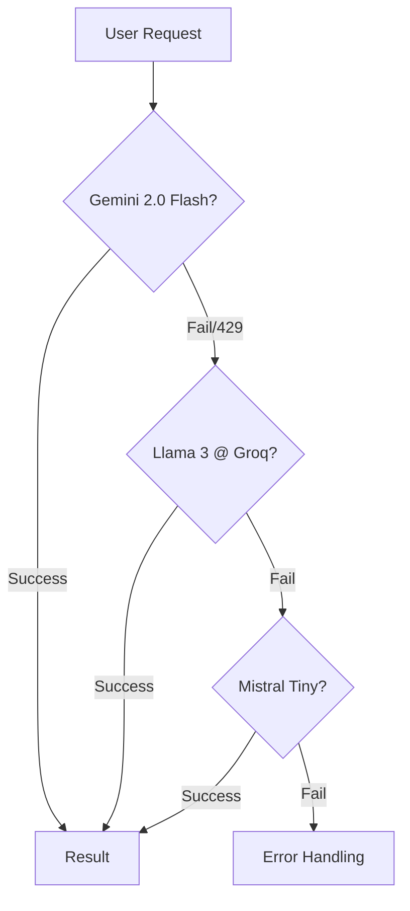

# 🛡️ Sentinel AI - Password Architect & Auditor


**Sentinel AI** is a next-generation cybersecurity tool that combines **generative AI** with traditional security algorithms. It serves two main purposes:
1.  **Architect**: Generating high-entropy, memorable passwords based on user themes (XKCD-style).
2.  **Auditor**: analyzing password strength using mathematical models and an AI "Red Team" persona that roasts your security choices.

---

## 🚀 Features

### 1. 🏗️ The Architect
Forget "Tr0ub4dor&3". Tell Sentinel a theme like *"Cyberpunk City"* or *"Tropical Beach"*, and it will generate a cryptographically strong yet memorable password such as:
> `Neon#Keyboard#Motorcycle#Helmet44`

### 2. 💀 Red Team Audit
We combine **zxcvbn** (Dropbox's entropy estimator) with a **Large Language Model (LLM)** configured as a ruthless brilliant hacker.
- **Quantitative**: Score (0-4), Crack Time, and offline hashing analysis.
- **Qualitative**: A biting, sarcastic roast of your password's weaknesses.

### 3. 🧗 The Model Ladder
Sentinel is built for resilience. It features a fail-safe **Model Ladder** that automatically switches providers if one is rate-limited or down.



---

## 🛠️ Tech Stack

- **Frontend**: [Streamlit](https://streamlit.io/) with custom CSS for a "Cyber Security" aesthetic.
- **Orchestration**: [LangChain](https://www.langchain.com/).
- **AI Models**:
    - **Primary**: Google Gemini 2.0 Flash (`langchain-google-genai`)
    - **Secondary**: Llama 3 on Groq (`langchain-groq`)
    - **Tertiary**: Mistral AI (`langchain-mistralai`)
- **Security Logic**: `zxcvbn` (Python port).

---

## 📦 Installation

1.  **Clone the repository**:
    ```bash
    git clone https://github.com/realarmaansidhu/SentinelAI.git
    cd SentinelAI
    ```

2.  **Install Dependencies**:
    ```bash
    pip install -r requirements.txt
    ```

3.  **Configure Environment**:
    Create a `.env` file (copy from `.env.example`) and add your API keys:
    ```ini
    GOOGLE_API_KEY=your_gemini_key
    GROQ_API_KEY=your_groq_key
    MISTRAL_API_KEY=your_mistral_key
    ```

4.  **Run the App**:
    ```bash
    streamlit run app.py
    ```

---

## 📸 Screenshots

| Architect Mode | Red Team Mode |
|:---:|:---:|
| Generate themed passwords | Get roasted by AI |

---

Made with ❤️ and ☕ by [Armaan Sidhu](https://github.com/realarmaansidhu)
