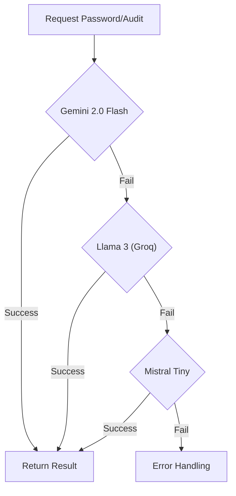

# 🛡️ SentinelXC - Password Architect & Auditor

  

> **"The only secure password is the one you can't remember. But SentinelXC makes it memorable."**

**SentinelXC** is a next-generation cybersecurity tool that combines **generative AI** with traditional security algorithms. It serves two main purposes:
1.  **Architect**: Generating high-entropy, memorable passwords based on user themes (XKCD-style).
2.  **Auditor**: analyzing password strength using mathematical models and an AI "Red Team" persona that roasts your security choices.

---

## 🚀 Features

### 1. 🏗️ The Architect
Forget "Tr0ub4dor&3". Tell Sentinel a theme like *"Cyberpunk City"* or *"Tropical Beach"*, and it will generate a cryptographically strong yet memorable password such as:
> `Neon#Keyboard#Motorcycle#Helmet44`

### 2. 💀 Red Team Audit
We combine **zxcvbn** (Dropbox's entropy estimator) with a **Large Language Model (LLM)** configured as a ruthless brilliant hacker.
- **Quantitative**: Score (0-4), Crack Time, and offline hashing analysis.
- **Qualitative**: A biting, sarcastic roast of your password's weaknesses.

### 3. 🧗 The Model Ladder
**SentinelXC** is built for resilience. It features a fail-safe **Model Ladder** that automatically switches providers if one is rate-limited or down.



### 4. 🛡️ Enterprise-Grade Security
- **Prompt Injection Defense**: Inputs are sandboxed in triple quotes and truncated to prevent LLM hijacking.
- **DoS Protection**: Strict input length limits prevent context window exhaustion attacks.
- **Fail-Safe Logging**: Comprehensive error tracking for the Model Ladder.

---

## 🔮 Future Roadmap

We are building the ultimate AI Security Suite. Coming soon:

### 📂 Phase 2: Batch Operations
- **Bulk Auditor**: Upload `.csv` or `.txt` files to audit thousands of passwords at once.
- **Factory Mode**: Generate batch passwords (e.g., 500x) for enterprise provisioning.

### 🔌 Phase 3: Integration
- **API Endpoint**: REST API to integrate SentinelXC's logic into your own apps.
- **Browser Extension**: Real-time password strength analysis in your browser.

---

## 🛠️ Tech Stack

- **Frontend**: Streamlit (Custom Cyberpunk Theme)
- **AI Core**: LangChain + Google Gemini / Groq / Mistral
- **Security**: zxcvbn + Custom Heuristics

---

## 📦 Installation

## How to Run
1.  **Clone**: `git clone https://github.com/realarmaansidhu/SentinelXC.git`
2.  **Navigate**: `cd SentinelXC`
3.  **Install**: `pip install -r requirements.txt`

4.  **Configure Environment**:
    Create a `.env` file (copy from `.env.example`) and add your API keys:
    ```ini
    GOOGLE_API_KEY=your_gemini_key
    GROQ_API_KEY=your_groq_key
    MISTRAL_API_KEY=your_mistral_key
    ```

5.  **Run the App**:
    ```bash
    a) treamlit run app.py
    b) ./environ/bin/python -m streamlit run app.py (in case of conflicts)
    ```

---

## 📸 Screenshots


---

Made with ❤️ and ☕ by [Armaan Sidhu](https://github.com/realarmaansidhu)
